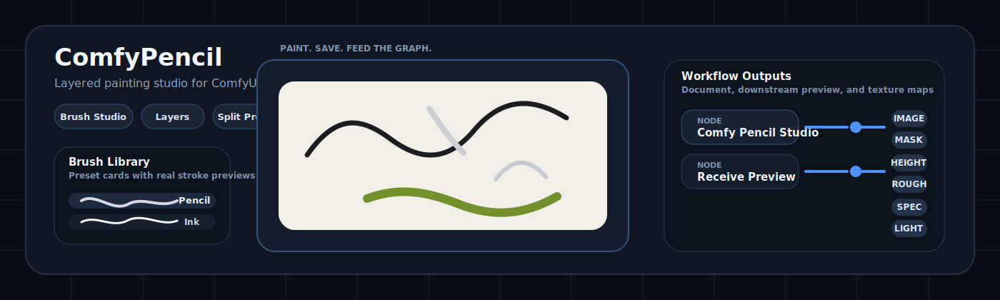
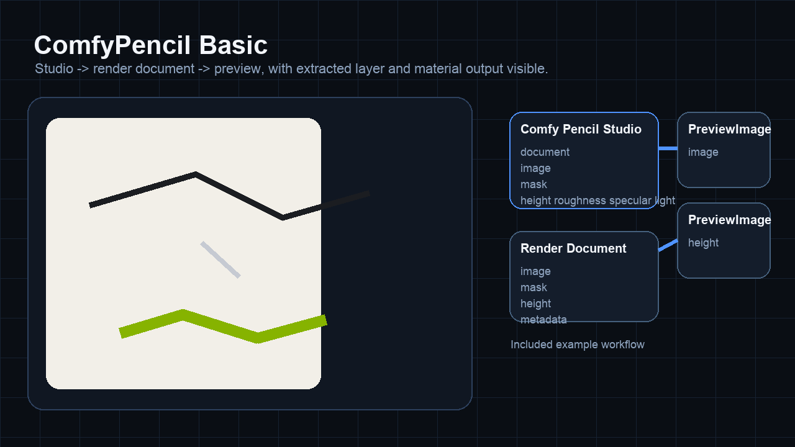
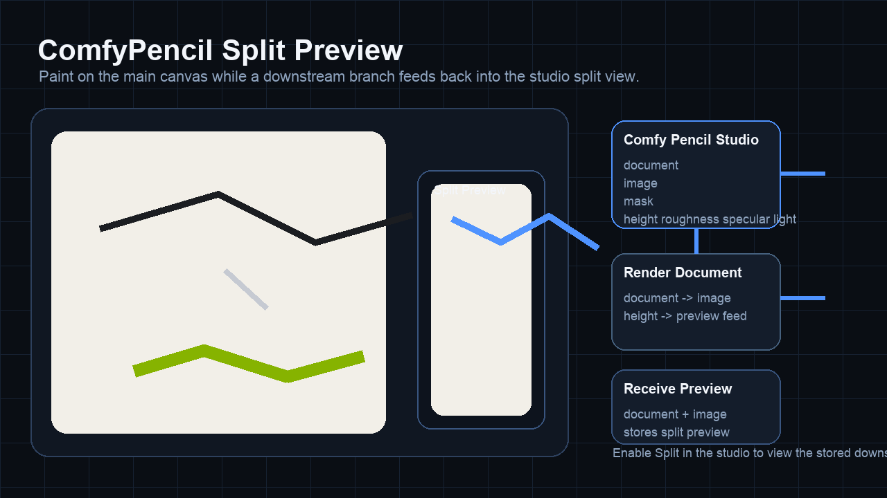
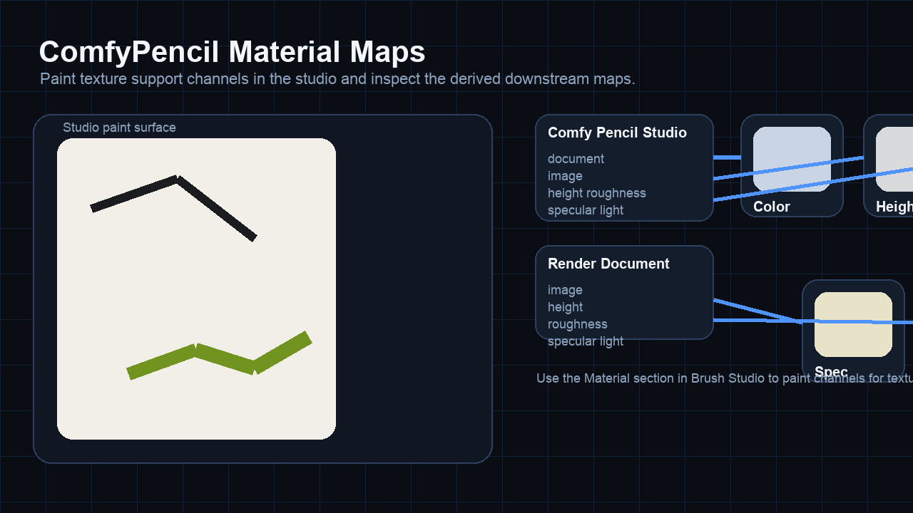

<p align="center">
  
</p>

# ComfyPencil

Full-screen painting workspace for ComfyUI with saved layered documents, brush editing, local recovery drafts, preset portability, split preview, and workflow-friendly render outputs.

Brush studio · Layer stack · `.pencilstudio` projects · Local draft recovery · Preset import/export · Split preview · Texture map outputs

## Overview

ComfyPencil replaces the usual paint-outside-import-later workflow with a dedicated studio window inside ComfyUI. It gives you one place to paint, manage layers, edit brush presets, save layered project files, and push image data straight into the graph.

It is built for the case where painting is part of the workflow, not a separate step around it.

## 2.0 Update

ComfyPencil 2.0 focuses on the parts that make the studio usable day to day instead of only impressive in a demo.

- Local recovery drafts keep newer unsaved work available after refreshes, save failures, or interrupted sessions
- Brush Library import/export makes custom preset sets portable
- Built-in shortcut help makes the studio easier to learn without leaving the canvas
- Save sequencing is safer when changes land during an in-flight autosave
- Package metadata and docs now reflect a real release surface

## Highlights

- Full-screen painting studio opened from the node, the selection toolbox, the sidebar tab, or the Extensions menu
- Brush library and brush studio with editable presets, pressure response, dynamics, wet mix, material channels, and custom saves
- Local recovery drafts with restore and dismiss actions inside the studio
- Preset library import/export for moving custom brush sets between setups
- Persistent custom color palette with palette import/export
- Drag-and-drop plus clipboard image import for faster layer intake
- Layer stack with reorder, duplicate, lock, alpha lock, blend modes, opacity, thumbnails, and per-layer persistence
- Native `.pencilstudio` format for portable layered save/load
- Split preview with downstream receiver support so you can paint while watching the graph result
- Material-aware painting that can output `height`, `roughness`, `specular`, and `light` maps for texture workflows
- Persistent document storage under the node pack so workflow files stay small

## What ComfyPencil Handles

ComfyPencil is meant to be a working surface, not just another image input. The studio handles:

- Brush authoring and custom preset saves
- Layered raster painting with saved document state
- Canvas assist settings such as symmetry, rotation, and stroke constraints
- Split preview round-tripping through downstream workflow nodes
- Portable project export/import through `.pencilstudio`
- Material painting for texture-oriented workflows

## Included Nodes

- [`Comfy Pencil Studio`](web/docs/ComfyPencilStudio.md)
  Main authoring node. Opens the studio and outputs the current document render.
- [`Comfy Pencil Receive Preview`](web/docs/ComfyPencilReceivePreview.md)
  Stores a downstream image back into the studio split preview.
- [`Comfy Pencil Render Document`](web/docs/ComfyPencilRenderDocument.md)
  Renders a `PENCIL_DOCUMENT` into `IMAGE`, `MASK`, and material maps.
- [`Comfy Pencil Import Layer`](web/docs/ComfyPencilImportLayer.md)
  Injects upstream images or masks as new layers in the document.
- [`Comfy Pencil Extract Layer`](web/docs/ComfyPencilExtractLayer.md)
  Pulls out a specific layer for downstream processing.

## Install

```bash
cd ComfyUI/custom_nodes
git clone https://github.com/criskb/Comfypencil ComfyPencil
```

Then:

1. Restart ComfyUI.
2. Hard refresh the browser after frontend updates.
3. Add a `Comfy Pencil Studio` node to a graph.
4. Open the studio and start painting.

ComfyPencil currently targets `ComfyUI >= 0.16.0` in [pyproject.toml](pyproject.toml).

## Using ComfyPencil

1. Add `Comfy Pencil Studio`.
2. Paint, manage layers, and save presets inside the studio.
3. Send the node outputs downstream like any other ComfyUI image source.
4. If you want live feedback, connect a `Comfy Pencil Receive Preview` node and enable split view.
5. Save the artwork either as document state in the node storage or as a portable `.pencilstudio` project.
6. Use `Import` / `Export` in the Brush Library when you want to move preset libraries around.
7. Build a personal swatch palette in the Colors panel and export it when you want to move it elsewhere.
8. Drop files onto the studio or paste an image from the clipboard to import layers quickly.
9. Press `?` or use `Help` in the header to open the built-in shortcut guide.

Included examples:

- [example_workflows/comfypencil_basic.json](example_workflows/comfypencil_basic.json)
- [example_workflows/comfypencil_split_preview.json](example_workflows/comfypencil_split_preview.json)
- [example_workflows/comfypencil_material_maps.json](example_workflows/comfypencil_material_maps.json)

These examples appear in ComfyUI's workflow template browser through the `example_workflows/` folder.

<p align="center">
  
  
  
</p>

## Storage And Project Files

ComfyPencil keeps document data on disk instead of embedding full bitmap payloads into the workflow JSON.

- Stored documents live under `data/documents/<document_id>/`
- Layer color and material images are saved as PNGs
- The node keeps lightweight document identity data in the graph
- `.pencilstudio` bundles are the portable export format for layered artwork
- Local recovery drafts live in browser storage and are cleared automatically after clean saves

## Material Outputs

When material painting is enabled in the brush settings, ComfyPencil can send separate downstream maps for:

- `height`
- `roughness`
- `specular`
- `light`

This makes the node usable for painting texture support maps linked to 3D or look-dev workflows instead of only flat color.

## Current Focus

ComfyPencil 2.0 is a stronger base, but it is still actively being shaped.

Current gaps worth knowing about:

- Browser blend preview and backend blend render are close, but not perfectly identical yet
- There is still no transform tool, lasso workflow, text layer, or vector stroke system
- The brush engine and UI are under active refinement

## Project Layout

```text
ComfyPencil/
├── __init__.py
├── assets/
│   └── comfypencil-banner.svg
├── backend/
│   ├── nodes.py
│   ├── routes.py
│   ├── store.py
│   └── rendering.py
├── example_workflows/
│   ├── comfypencil_basic.json
│   ├── comfypencil_split_preview.json
│   └── comfypencil_material_maps.json
├── tests/
│   └── test_backend.py
├── web/
│   ├── comfy_pencil_extension.js
│   ├── docs/
│   └── studio/
└── README.md
```

## Development Notes

- Main frontend extension entry: [web/comfy_pencil_extension.js](web/comfy_pencil_extension.js)
- Studio UI shell: [web/studio/studio-app.js](web/studio/studio-app.js)
- Canvas engine: [web/studio/canvas-engine.js](web/studio/canvas-engine.js)
- Brush rendering path: [web/studio/brush-stamp.js](web/studio/brush-stamp.js)
- Recovery storage: [web/studio/studio-recovery.js](web/studio/studio-recovery.js)
- Preset file portability: [web/studio/brush-preset-files.js](web/studio/brush-preset-files.js)
- Shortcut/help data: [web/studio/studio-shortcuts.js](web/studio/studio-shortcuts.js)
- Document/project persistence: [backend/store.py](backend/store.py)
- Node implementations: [backend/nodes.py](backend/nodes.py)

Useful checks while working on the pack:

```bash
python3 tests/test_backend.py
python3 tests/test_repo_assets.py
python3 -m py_compile backend/store.py backend/routes.py backend/nodes.py
node --check --input-type=module < web/studio/studio-app.js
```

GitHub Actions CI is included in [.github/workflows/ci.yml](.github/workflows/ci.yml) and runs the backend tests, repo-asset checks, and frontend syntax checks on pushes and pull requests.

Release notes for the current major version live in [CHANGELOG.md](CHANGELOG.md).

## License

See [LICENSE](LICENSE).
